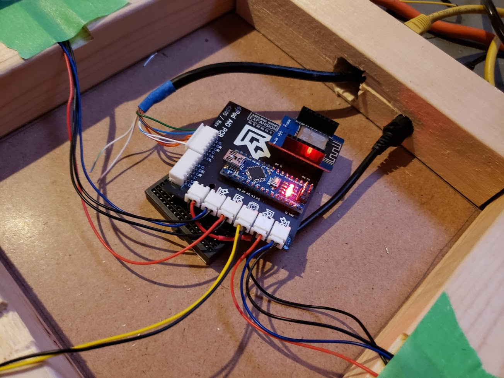

# djPad
Open source, accessible, and hopefully inexpensive velostat based PIU pad design, for beginners and experts alike

**Credits**
- Arduino/ESP8266 code - [Skogaby](https://github.com/skogaby/velostatdancecrew2k19/)
